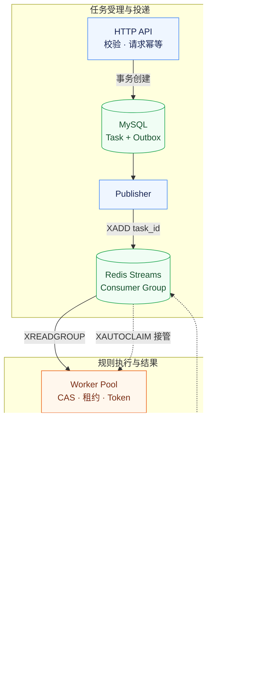

<div align="center">

# LuaSpider

**Lua 规则驱动的多源数据采集平台**

用 Go 管理任务生命周期，用 Lua 适配数据来源。<br>
从异步采集、可靠投递到结构化快照与分析工作台。

<p>
  
  
  
  
  
</p>

[核心能力](#capabilities) · [系统架构](#architecture) · [快速启动](#quickstart) · [规则扩展](#rules) · [开发与验证](#development)

</div>

---

不同网站的页面结构会变化，但任务调度、并发控制和结果存储不应随之重写。LuaSpider 将这些能力沉淀为共享后端，站点差异交给 Lua 规则处理。

**GitHub Trending 与 Hacker News 是两个接入示例，而不是平台边界。** 在现有 HTTP / DOM 能力范围内，新增来源只需增加规则脚本与元数据，即可复用任务链路和结果展示。

<a id="capabilities"></a>
## 核心能力

| 采集与扩展 | 执行与可靠性 | 分析与排障 |
| :--- | :--- | :--- |
| Lua 描述请求、解析与字段转换 | API、Publisher、Worker 独立进程 | 结构化结果与历史快照 |
| `items / meta` 统一结果契约 | Worker Pool 限制执行并发 | 排行、字段分布与数值趋势 |
| 本地规则更新，无需重新编译 Go | 独立 LState 与 Context 超时 | 快照差异与字段质量检查 |
| 规则元数据映射不同来源字段 | Outbox 投递与 Streams 故障接管 | 规则健康度与任务事件追踪 |

工作台将采集结果组织为可查看、可比较的快照；后端保留任务状态、错误信息与执行事件，支持从数据异常回溯到对应任务。

<a id="architecture"></a>
## 系统架构

**MySQL 保存任务事实，Redis 传递任务引用，Worker 执行 Lua 规则。**



### 为什么这样设计

| 工程问题 | 设计选择 | 作用 |
| :--- | :--- | :--- |
| 慢网站占用请求处理时间 | 异步受理 + 固定 Worker | API 返回任务 ID，执行并发由 Worker 数控制 |
| 站点解析规则频繁变化 | Lua 规则与 Go 引擎解耦 | 更新解析逻辑无需重新编译 Go 服务 |
| 规则状态串扰、执行失控 | 每任务独立 LState + Context | 隔离全局变量，将截止时间传入 VM 与 HTTP 请求 |
| MySQL 成功后消息未发出 | Task 与 Outbox 同事务 | Publisher 可继续投递未发布记录 |
| 重投、并发抢占与旧执行者恢复 | 状态 CAS + 租约 + 运行令牌 | 接管后替换令牌，拒绝旧执行者提交 |
| 完成落库与消息确认存在间隙 | 结果与终态同事务，提交后 ACK | 重放时识别终态，避免重复提交结果 |

> **交付语义：至少一次投递 + 幂等终态提交。** 消息和外部抓取可能重复，系统不承诺跨 Redis / MySQL 的 Exactly Once。

<a id="quickstart"></a>
## 快速启动

需要 **Docker 与 Docker Compose**，也可使用 Docker Desktop。在仓库根目录执行：

```bash
cp .env.example .env
```

将 `.env` 中的 `MYSQL_ROOT_PASSWORD` 改为本地演示密码，然后启动：

```bash
docker compose up --build -d
```

打开 **[localhost:8080](http://localhost:8080/)** 进入工作台。Compose 启动 API、Publisher、Worker、MySQL 和 Redis；默认配置 4 个 Worker，可在 `.env` 中调整 `WORKERS`。

<details>
<summary>Windows PowerShell</summary>

```powershell
Copy-Item .env.example .env
# 修改 .env 中的本地演示密码后启动
docker compose up --build -d
```

</details>

### 创建一条采集任务

```bash
curl -X POST http://localhost:8080/api/v1/tasks \
  -H 'Content-Type: application/json' \
  -d '{
    "request_key": "demo-github-001",
    "target": "github_trending_go",
    "url": "https://github.com/trending/go?since=daily"
  }'
```

用响应中的任务 ID 查询状态和结果：

| 接口 | 用途 |
| :--- | :--- |
| `POST /api/v1/tasks` | 创建异步任务 |
| `GET /api/v1/tasks/{id}` | 查询执行状态与错误 |
| `GET /api/v1/tasks/{id}/result` | 获取已保存的结果快照 |

同一次请求重试时保持 `request_key` 不变；发起新一轮采集时使用新值。外部站点的网络可达性、限流与页面变化会影响采集结果，可在工作台查看任务错误。

<details>
<summary>停止服务与保留数据</summary>

```bash
docker compose down
```

默认保留 MySQL / Redis 数据卷。`.env` 不应提交到版本库。

</details>

<a id="rules"></a>
## 规则扩展

**一份脚本定义采集，一份元数据定义来源与展示。**

| 示例来源 | Target | 规则 |
| :--- | :--- | :--- |
| GitHub Go Trending | `github_trending_go` | [github_trending.lua](scripts/github_trending.lua) |
| Hacker News | `hackernews_top` | [hackernews_collection.lua](scripts/hackernews_collection.lua) |

1. 在 `scripts/` 新增受信任的 Lua 脚本，调用宿主提供的 HTTP / DOM 能力。
2. 成功返回 `true, {items = {...}, meta = {...}}`，失败返回 `false, "error message"`。
3. 在 [configs/rules.yaml](configs/rules.yaml) 注册来源 ID、脚本路径、URL、唯一键、最小条数与展示字段映射。
4. 使用该来源 ID 作为 API 请求的 `target`，复用已有调度与持久化链路。

| 宿主能力 | 用途 |
| :--- | :--- |
| `http_get` | 获取页面内容 |
| `html_find` / `html_find_all` | 按选择器提取文本 |
| `html_attr_all` | 提取链接等 HTML 属性 |
| `url_resolve` | 解析相对 URL |
| `TARGET_URL` | 当前任务目标地址 |

注册规则在任务执行时读取本地脚本，后续任务可使用更新内容。默认规则另有文件监听与文本缓存机制。当前 Compose 将规则打包进镜像；通过镜像部署规则变更需重新构建，文件级热更新需要更新实际运行环境中的规则文件。

<a id="development"></a>
## 开发与验证

**后端** · Go / Gin / GORM / gopher-lua / goquery / fsnotify<br>
**存储与队列** · MySQL / Redis Streams<br>
**诊断与运行** · zap / pprof / Go Test / Docker Compose<br>
**工作台** · HTML / CSS / JavaScript / ECharts / Lucide

<details>
<summary>项目目录与职责</summary>

```text
LuaSpider/
├── cmd/
│   ├── server/        HTTP API 与静态工作台
│   ├── publisher/     Outbox 发布进程
│   └── worker/        消费与故障接管进程
├── configs/           服务配置与规则元数据
├── internal/
│   ├── engine/        Lua VM、HTTP/DOM 与结果契约
│   ├── handler/       任务、分析与事件接口
│   ├── queue/         Redis 客户端与 Stream 操作
│   ├── repository/    MySQL 模型、事务、CAS 与查询
│   ├── service/       Outbox 发布编排
│   ├── task/         任务状态与领域模型
│   ├── worker/       Consumer、Reclaimer 与执行器
│   └── router/       路由与静态页面服务
├── scripts/           Lua 采集规则
├── web/               分析工作台
├── .env.example       本地环境变量模板
└── docker-compose.yml 本地多进程演示环境
```

</details>

<details>
<summary>测试与构建命令</summary>

```bash
go test ./...
go vet ./...
go build ./...
node --test web/assets/analysis.test.mjs web/assets/workbench.test.mjs
```

部分集成测试需要对应的 MySQL / Redis 环境；被跳过的测试不代表该链路已验证。测试和构建结果应以实际执行输出为准。

</details>

## 使用边界

- **部署**：公开 Compose 为本地单节点依赖环境。Worker 支持跨进程协作，不等同于 Redis / MySQL 高可用集群。
- **规则**：当前面向受信任的本地脚本；Context 限时不等于每脚本硬内存隔离，不提供未审查脚本上传或多租户权限。
- **恢复**：支持未确认、非终态任务的故障接管；已记录的 Lua / HTTP 失败不会自动无限重试，Redis 数据全量丢失不在完整自动恢复保证内。
- **容量**：固定 Worker 限制执行并发，不代表持久化队列积压有硬上限。持续过载仍需容量规划与接入控制。
- **采集**：仅在获得许可的范围内使用，遵守目标站点规则并控制请求频率；不提供验证码绕过或通用反爬能力。
